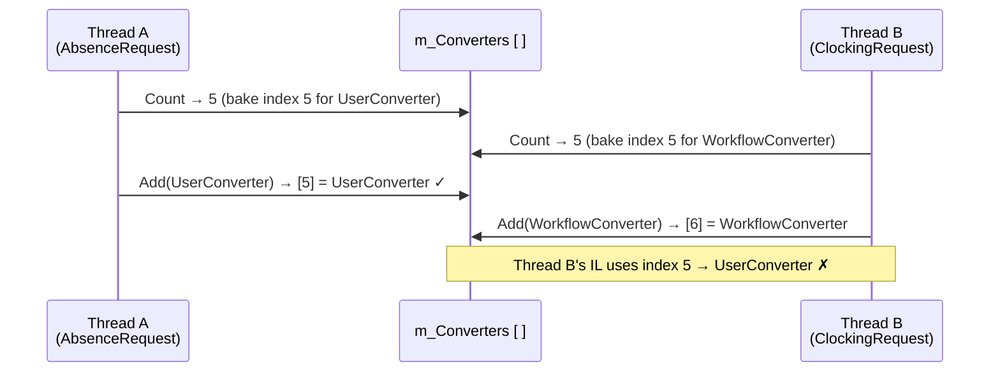

# The Race Condition

`m_Converters` is a plain `List<>` with **no locking**. Reading its size and appending to it are two separate, unprotected operations.

When two threads compile factories concurrently, they can both read the same `Count` before either calls `Add`:

Thread B's factory permanently looks up index **5** expecting a workflow converter — but finds the user converter instead → `InvalidCastException` on every call.

> **Why it sticks:** the broken factory is stored in NPoco's process-wide **MemoryCache**. Every subsequent request for that type hits the same corrupt factory — until the process restarts and the cache is cleared.
